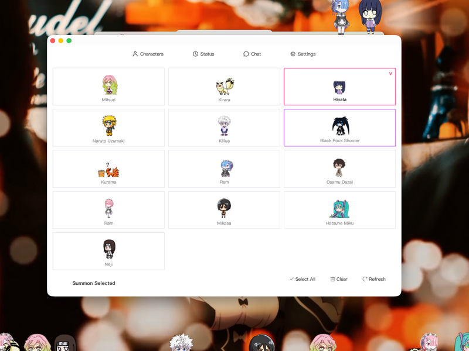
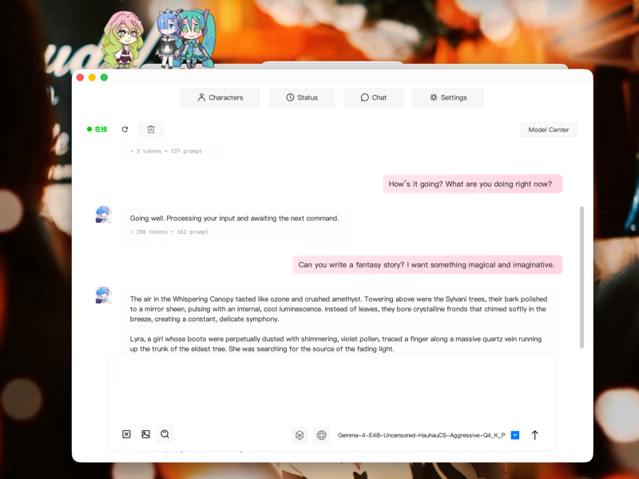

# JPetRemAI

🤖 **AI Desktop Pet for macOS with Local LLM Support**


---

## ✨ Features

### 🤖 AI Integration
- **Local LLM Inference**: Built-in llama.cpp engine with GGUF/MLX model support
- **HuggingFace Integration**: Browse and download models from HuggingFace Hub
- **Multi-Model Support**: Route requests between HuggingFace, mirrors, and LM Studio

### 🐾 Desktop Pet
- **Pixel Characters**: 8+ built-in characters (Rem, Ram, Mikasa, Hatsune Miku, etc.)
- **Physics-Based Animation**: 46-frame animation sequences per character
- **Interactive Behaviors**: Walking, jumping, climbing, throwing interactions

### 🎨 UI/UX
- **Pure White Theme**: Modern macOS aesthetic
- **Glass Morphism**: Liquid glass effects and rounded corners
- **i18n Support**: 12 languages including Chinese, English, Japanese, Korean

---

## 📸 Screenshots





---

## 📥 Installation

### Prerequisites
- macOS 10.13 or later
- Java 17 (bundled with app)

### Download
```bash
git clone https://github.com/Alexanderava/JPetRemAI.git
```

---

## 🚀 Usage

### Launch
```bash
open /Applications/JPetRemAI.app
```

### Remote Control API
Connect to the Socket API (port 17521) for programmatic control:

```python
import socket
HOST = "127.0.0.1"
PORT = 17521

with socket.create_connection((HOST, PORT), timeout=120) as s:
    s.sendall(b"summon:蕾姆\n")
    print(s.recv(4096).decode())
```

---

## 🛠️ Open Source Dependencies

This project uses the following open source libraries:

| Library | License | Description |
|---------|---------|-------------|
| [Shimeji-ee](https://github.com/hyakumeguri/shimeji-ee) | BSD | Desktop mascot engine |
| [llama.cpp](https://github.com/ggerganov/llama.cpp) | MIT | LLM inference engine |
| [Javassist](https://www.jboss.org/javassist) | MPL/LGPL | Java bytecode manipulation |
| [FlatLaf](https://www.formdev.com/flatlaf/) | Apache 2.0 | Modern Swing UI theme |
| [CFR](https://github.com/leibnitz27/cfr) | MIT | Java decompiler |

See [THIRD-PARTY.md](THIRD-PARTY.md) for full attribution.

---

## ⚠️ Character Resources

### Character Source
Character sprites are downloaded from [shimejimascot.com](https://www.shimejimascot.com), a community-driven Shimeji mascot platform. Users can search and download various character packs from this website.

### Copyright Notice
Built-in characters include:
- 蕾姆 / 拉姆 - © Nie R
- 三笠 - © Hajime Isayama
- 初音未来 - © Crypton Future Media
- Other anime characters

> **Important**: Characters downloaded from shimejimascot.com are for **personal use only**. Please respect the original creators' copyright and terms of use. Commercial use is strictly prohibited.

---

## 📄 License

MIT License - See [LICENSE](LICENSE) file for details.

---

<p align="center">Made with ❤️</p>
